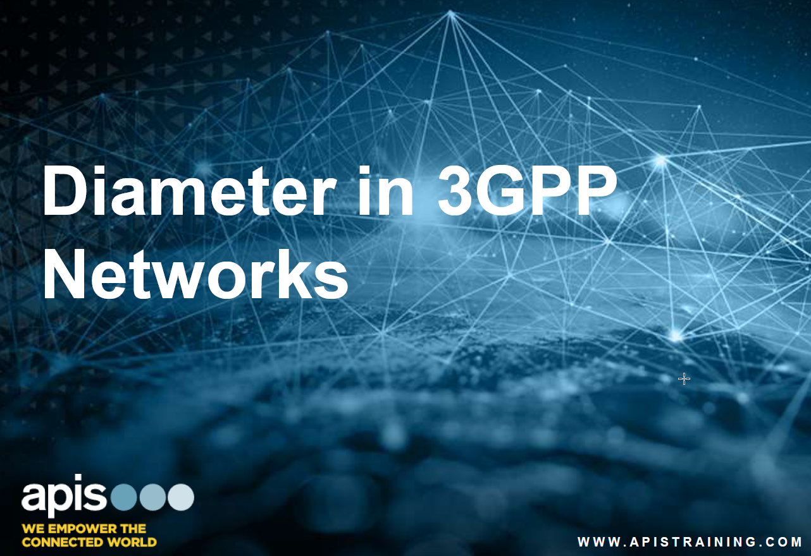

# Diameter in 3GPP Networks

Fantastic training, I totally recommend any telecommunications engineer to do this training. Here I found the missing link to understand the entire ecosystem.&#x20;



<figure><figcaption></figcaption></figure>

## Welcome aboard!

Do you want to test your proprietary AVPs? Contact me!

Or maybe Diameter Security? 🐱‍👤

Anyway, we all can interrogate anytime...



RFS is here to help!

<figure><figcaption></figcaption></figure>
